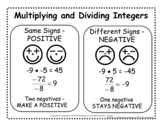

# M7 2.4 Multiplying and Dividing Integers

## Notes

I can multiply and divide integers.

### Careful!

- $(-3)^{2}=$
- $-3^{2}=$

## Practice

1. $-5 \cdot 4=$
1. $2 \cdot (-8)=$
1. $(-1)(-1)=$
1. $-6 \cdot 3 =$
1. $7(-3)=$
1. $(-8)(-4)=$
1. $-6 \cdot 5=$
1. $(-9)(-9)=$
1. $36 \div (-4)=$
1. $-27 \div 9=$
1. $(-24) \div (-6)=$
1. $\frac{-30}{5}=$
1. $\frac{18}{-6}=$
1. $-32 \div (-8)=$
1. $\frac{-45}{-9}=$
1. $(-40) \div 10=$

 Evaluate using $x = 03$, $y=5$, $z=-30$

1. $xy=$
1. $x+y=$
1. $z \div y=$
1. $\frac{z}{xy}=$

 Evaluate using $a=2$, $b=-3$, $c=-12$

1. $\frac{ab}{c}=$
1. $b+c=$
1. $b^{a}-c=$
1. $abc=$

1. A football team must move the ball forward at least 10 yards from its starting point to make a first down. If the team has 2 losses of 3 yards each and a gain of 14 yards, does the team make a first down?

    

    + Yes
    - No

1. $(-1)^{2}=$
1. $(-1)^{3}=$
1. $(-1)^{4}=$
1. $(-1)^{18}=$
1. $(-1)^{37}=$
1. $-(-1)^{4}=$
1. $-(4-6)=$
1. $(-2)(3)(-1)(-6)=$

 Evaluate using $a=4$, $b=-5$, $c=-20$, $d=-10$

1. $\frac{abd}{c}=$ 
1. $ac-bd=$

## Homework

### Find each product

1. $6 \cdot-1=$
1. $-4 \cdot 2=$
1. $-3-4=$
1. $-2 \cdot 8=$
1. $5(-7)=$
1. $(-7)(9)=$
1. $8 \cdot (-4)=$
1. $-3 \cdot (-5)=$

### Evaluate using $x=-2$, $y=-3$,  $z=5$

1. $xy-z=$
1. $y^{2}-x=$
1. $xyz=$

### Find each quotient

1. $12 \div -4=$
1. $-15 \div -3=$
1. $-20÷5=$
1. $\frac{-27}{-9}=$
1. $-45 \div -5=$
1. $\frac{-18}{9}=$
1. $\frac{24}{-4}=$
1. $-32 \div -4=$

### Evaluate using $a=-3$, $b=-4$,  $c=12$

1. $\frac{ab}{c}=$
1. $\frac{a^{2}}{b^{2}}=$
1. $\frac{b^{2}}{-2a}$

### Word problem
1. Jenny was walking down Sabino Canyon. For 4 minutes, the elevation dropped uniformly. Altogether it dropped 32 feet. What was the change in elevation per minute?

### Mixed Review

#### Find the sum or difference

1. $-2+9=$
1. $-4+-10=$
1. $5-(-3)=$
1. $-8-7=$
1. $-9-(-6)=$
1. $12+(-2)=$
1. $-14-4=$
1. $-10+(-5)=$
1. $-8+4+(-2)=$
1. $-3-5+2=$
1. $-7-4-(-5)=$

